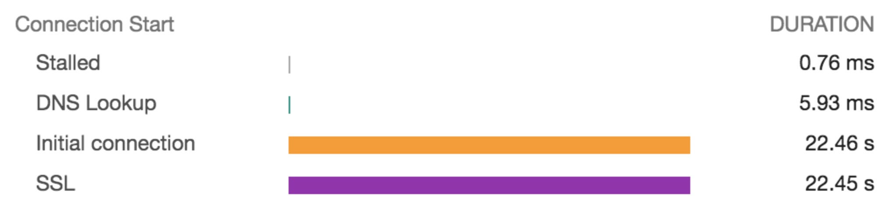
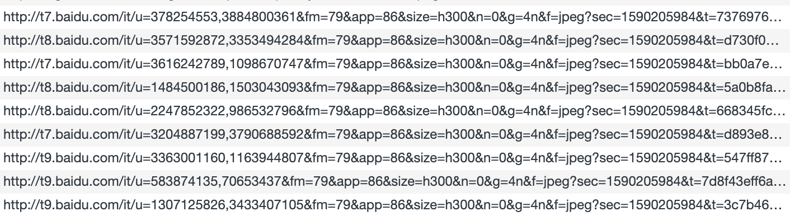

```
在大佬的带领下，非常荣幸的欣赏了一下号称代码规范界B格最高的chromium源码，虽然我是一句都没看懂......
```
# 一次难忘的性能排查
## 零. 问题&背景
### 1.问题描述
- 描述

    发现某包含大量图片/视频的页面，在有些电脑上加载非常慢，经初步排查发现【Initial Connection】耗时22.46s,其中【SSL】耗时22.45s，而服务端抓包却并未发现异常情况，关键这个请求最后还成功了，而在每个电脑上的表现还不一样，我的电脑上就快一些。

### 2.静态资源域名隔离说明
- 举个栗子


    说明:每个静态资源的二级域名几乎都不一样，而且都带有数字，似乎仅仅是用来区别URL的。
- 原因
   > There are already six TCP connections open for this origin, which is the limit. Applies to HTTP/1.0 and HTTP/1.1 only.

    说明:引自[chrome开发者文档](https://developers.google.com/web/tools/chrome-devtools/network/reference#timing-explanation) 。此外baidu or google【Browser Connection Limit】会找到很多关于这方面的文章。
    
- 上述问题实现

    基于以上原因，我们系统也对域名做了隔离，将资源随机散列到1000个域名上。

## 一. 问题定位
### 1.chrome日志抓取与分析:chrome://net-internals/#events
##### &emsp;1) 日志抓取:chrome://net-export/
##### &emsp;2) 日志分析:https://netlog-viewer.appspot.com/#import or 插件[Chromium NetLog dump viewer](https://chrome.google.com/webstore/detail/chromium-netlog-dump-view/hfnehammfofphmomkllapngelnabmcho?utm_source=chrome-ntp-icon) 
- 日志片段

    ```
    t=10377 [st=   18]     +CERT_VERIFIER_REQUEST  [dt=17951]
    t=10377 [st=   18]        CERT_VERIFIER_REQUEST_BOUND_TO_JOB
                              --> source_dependency = 32905 (CERT_VERIFIER_JOB)
    t=28328 [st=17969]     -CERT_VERIFIER_REQUEST
    ```
    ```
    t=10377 [st=    0] +CERT_VERIFIER_JOB  [dt=17951]
                        --> certificates = ......                        
                        --> verifier_flags = 0 ()
                        --> host = "xxx.xxx.xxx.xxx"
    t=28328 [st=17951] -CERT_VERIFIER_JOB
                        --> verified_cert = ......
                        --> cert_status = 0 ()
                        --> has_md2 = false
                        --> has_md4 = false
                        --> has_md5 = false
                        --> is_issued_by_additional_trust_anchor = false
                        --> is_issued_by_known_root = true
                        --> public_key_hashes = [...]
    ```
- 总结&分析
    
    - 从日志看出【CERT_VERIFIER_JOB】这个任务花了17.951秒，问题应该出在这里。
    - 说明1:每一日志都会有对应的事件类型(eg:+CERT_VERIFIER_JOB),+表示开始，-表示结束，后面是参数。
    - 说明2:第一列(eg:t=10377)表示全局时间线，第二列(eg:[st=17951])是事件内时间线，【source_dependency= xxx】表示依赖关系。
    - 说明3:依赖关系并不表示先后执行顺序，要根据时间线判断执行顺序来推断问题【重要】。

### 2.源码猜测分析【实在是看不懂c++的代码，只能靠猜了】  
##### &emsp;1）[源码查看地址](https://source.chromium.org/chromium/chromium/src/+/master:net/log/net_log_event_type_list.h?q=net_log_event_type_list.h%20&ss=chromium&originalUrl=https:%2F%2Fcs.chromium.org%2F) 
说明：net_log_event_type_list.h文件包含日志中所有事件的列表,与日志文件对应可以作为排查问题的入口。
##### &emsp;2）源码片段
- 片段1

    ```
    int CoalescingCertVerifier::Verify(
    ...
      Job* job = FindJob(params);
      if (job) {
        // An identical request is in-flight and joinable, so just attach the
        // callback.
        ++inflight_joins_;
      } else {
        // No existing Jobs can be used. Create and start a new one.
        std::unique_ptr<Job> new_job =
            std::make_unique<Job>(this, params, net_log.net_log(), requests_ == 1);
        int result = new_job->Start(verifier_.get());
        if (result != ERR_IO_PENDING) {
          *verify_result = new_job->verify_result();
          return result;
        }
    
        job = new_job.get();
        joinable_jobs_[params] = std::move(new_job);
      }
    ```
  
- 片段2

    ```
    // This function is called by BoringSSL, so it has to return an
    // ssl_verify_result_t. When specific //net errors need to be
    // returned, use OpenSSLPutNetError to add them directly to the
    // OpenSSL error queue.
    ssl_verify_result_t SSLClientSocketImpl::VerifyCert() {
      if (cert_verification_result_ != kCertVerifyPending) {
        // The certificate verifier updates cert_verification_result_ when
        // it returns asynchronously. If there is a result in
        // cert_verification_result_, return it instead of triggering
        // another verify.
        return HandleVerifyResult();
      }
    ...
    ...
      cert_verification_result_ = context_->cert_verifier()->Verify(
          CertVerifier::RequestParams(
              server_cert_, host_and_port_.host(), ssl_config_.GetCertVerifyFlags(),
              ocsp_response.as_string(), sct_list.as_string()),
          &server_cert_verify_result_,
          base::BindOnce(&SSLClientSocketImpl::OnVerifyComplete,
                         base::Unretained(this)),
          &cert_verifier_request_, net_log_);
    
      return HandleVerifyResult();
    }
    ```
  
- 片段3

    ```
    ssl_verify_result_t SSLClientSocketImpl::VerifyCertCallback(
        SSL* ssl,
        uint8_t* out_alert) {
      SSLClientSocketImpl* socket =
          SSLContext::GetInstance()->GetClientSocketFromSSL(ssl);
      DCHECK(socket);
      return socket->VerifyCert();
    }
    ```
  
- 片段4

    ```
      SSLContext() {
        crypto::EnsureOpenSSLInit();
        ssl_socket_data_index_ =
            SSL_get_ex_new_index(0, nullptr, nullptr, nullptr, nullptr);
        DCHECK_NE(ssl_socket_data_index_, -1);
        ssl_ctx_.reset(SSL_CTX_new(TLS_with_buffers_method()));
        SSL_CTX_set_cert_cb(ssl_ctx_.get(), ClientCertRequestCallback, nullptr);
    
        // Verifies the server certificate even on resumed sessions.
        SSL_CTX_set_reverify_on_resume(ssl_ctx_.get(), 1);
        SSL_CTX_set_custom_verify(ssl_ctx_.get(), SSL_VERIFY_PEER,
                                  VerifyCertCallback);
        // Disable the internal session cache. Session caching is handled
        // externally (i.e. by SSLClientSessionCache).
        SSL_CTX_set_session_cache_mode(
            ssl_ctx_.get(), SSL_SESS_CACHE_CLIENT | SSL_SESS_CACHE_NO_INTERNAL);
        SSL_CTX_sess_set_new_cb(ssl_ctx_.get(), NewSessionCallback);
        SSL_CTX_set_timeout(ssl_ctx_.get(), 1 * 60 * 60 /* one hour */);
    
        SSL_CTX_set_grease_enabled(ssl_ctx_.get(), 1);
    ...
    ...
    ```

##### &emsp;3）总结&猜测
- 片段1应该是create job去验证的逻辑，每个电脑执行job的能力不一样，我的电脑配置好一些，所以时间短一点。
- 片段2-4应该是根据域名初始化SSLContext时进行的证书验证的逻辑。

## 二.问题解决
### 1.原因
根据日志及源码猜测分析可能的原因是：这个域名是国外域名，证书的验证也在国外，所以耗时比较长。
### 2.解决方案
- 方案一:优化域名的散列逻辑。
    
    只散列10个域名，而且也不再随机分配，先随机一个开始域名，然后根据页面中资源加载顺序分配。由connetion limit推算可以支持60个并发请求，另外这种方案还能利用http的keep-alive特性来加快资源下载。eg:random=8,则域名依次为:d8.xxx.xxx，d9.xxx.xxx，d0.xxx.xxx...

- 方案二:chrome插件 [OCSP Checker](https://chrome.google.com/webstore/detail/ocsp-checker/ajgbaimfmdjocihpimgbonjinhkeffnf) 具体介绍请看插件说明。

说明:方案一首次加载还是很慢，首次之后就很快了。方案一、方案二并不冲突。
    
## 三.排查过程中的意外收获
### 1.关于证书验证:[Online Certificate Status Protocol](https://en.wikipedia.org/wiki/Online_Certificate_Status_Protocol)
> The Online Certificate Status Protocol (OCSP) is an Internet protocol used for obtaining the revocation status of an X.509 digital certificate.

说明:引自wikipedia，文中指出google chrome在2012年禁用了这个协议，使用自己的方式来验证证书。

### 2.tracing:[chrome://tracing](https://www.chromium.org/developers/how-tos/trace-event-profiling-tool)
- 相关文档

    https://www.chromium.org/developers/how-tos/trace-event-profiling-tool
    
    https://www.chromium.org/developers/how-tos/trace-event-profiling-tool/trace-event-reading

    PS:这个工具据说能具体到chrome中的函数调用，我简单试了下，没用明白，也没深研究。 

### 3.[chrome的bug平台](https://bugs.chromium.org/p/chromium/issues/list) 

- BUG:[723748](https://bugs.chromium.org/p/chromium/issues/detail?id=723748) 

    这个bug跟我们遇到的现象非常像，让我们一度误以为这是chrome未解决的bug。

- BUG:[1074684](https://bugs.chromium.org/p/chromium/issues/detail?id=1074684)

    这个bug跟我们遇到的现象也非常像，浏览器版本也对的上，也让我们一度误以为这是chrome的bug，并且让一个同学换成firefox试了下发现确实还可以，直到发现其他同学在firefox上依旧很慢。
    
## 四.总结

一次让人抓狂的问题排查过程! 之前对于浏览器使用还只停留在开发者工具上，通过这次问题定位，算是长了见识了。特以此文纪念一下，虽然可能也不准备深究了。  