# 源码阅读: netty初探
```puml
Netty作为各大Rpc的数据通信组件而久负盛名，我一直想了解一下其原理。本文主要简述netty的执行流程，旨在了解框架，能把源码读下去，并不涉及Netty的每一个细节————让阅读源码成为习惯
```
## 一.基本概念
- Channel：是个facade，主要成员变量:java.nio.channels.Channel、Pipeline、Unsafe及EventLoop。
- EventLoop：IO操作执行线程，主要成员变量:java.nio.channels.Selector和Task-Queue。EventLoop与Channel的数量关系是1:N。
- Pipeline & ChannelHandler：类似j2ee中filter机制，负责处理编解码及业务逻辑。Netty把ChannelHandler封装为ChannelHandlerContext放在Pipeline的head、tail链表(正序链表、逆序链表)中;其中，IO触发(eg:accept/read等等)从head开始执行，用户发起IO(eg:bind/connect/write等)从tail开始执行。
- Unsafe：非字面不安全意思，实际是指Netty的内部接口，不应该被外部直接调用。代理Channel中IO相关的操作。
- Promise：相当于可设置结果的Future。
- ByteBuf：加强版的ByteBuffer，支持自动扩容、Buffer缓冲池等功能。
## 二.Netty线程模型:EventLoop
### 1.Server&Client工作流程图
- Server

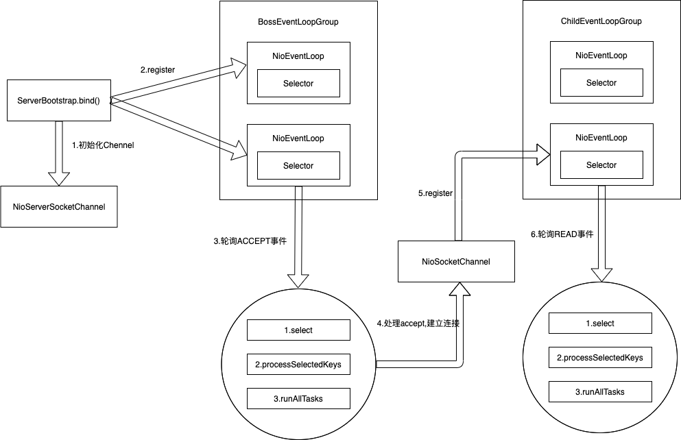

- Client

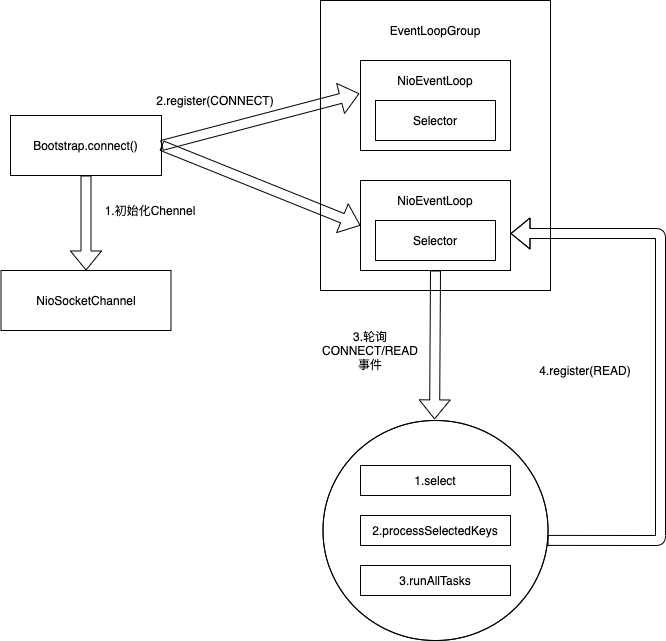
### 2.监听流程(代码逻辑:io.netty.channel.nio.NioEventLoop.run())
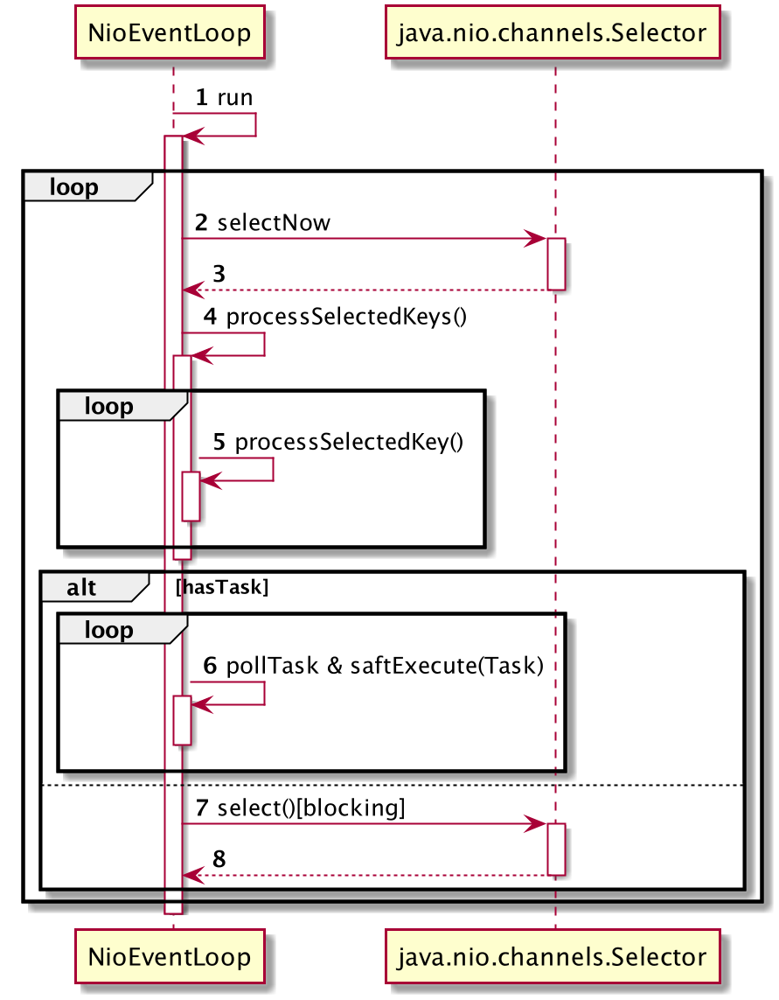

##### &emsp;1).监听流程简述
- 监听Selector，处理IO事件：ACCEPT、CONNECT、WRITE及READ。
- 执行taskQueue队列中的task；用户发起的IO一般通过Channel.eventLoop().execute(Runnable)放入task-queue，由EventLoop线程串行执行。
- 优先处理IO事件, IO事件处理完了，根据IO事件的处理时间和ioRatio分配执行task的时间。
- 没有IO事件和Task时，会block在Selector.select()上，有IO事件自动被唤醒，往task-queue添加task后也会唤醒Selector。

##### &emsp;2).accept事件处理
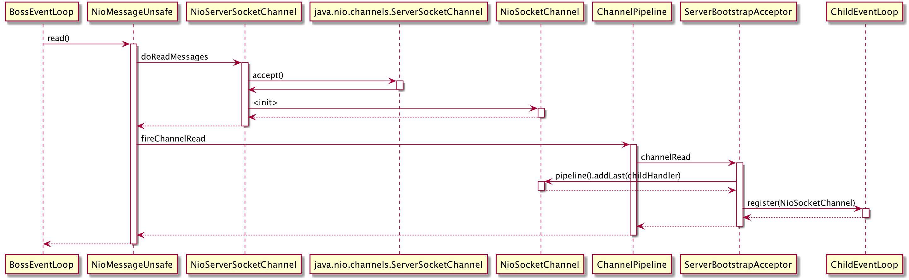

##### &emsp;3).read事件处理
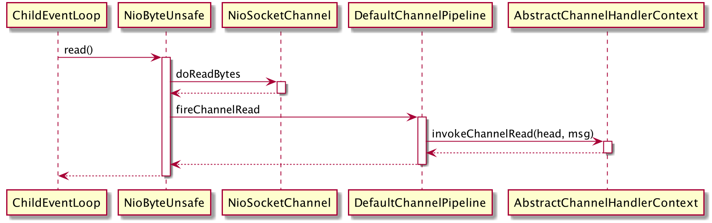

##### &emsp;4).connect & write
略


## 三.完整的bind流程

说明:绑定流程主要包括两部分:(1)在主线程初始化 (2) 在EventLoop中执行task，在EventLoop线程执行过程中还会加入新的task。

### 1.初始化
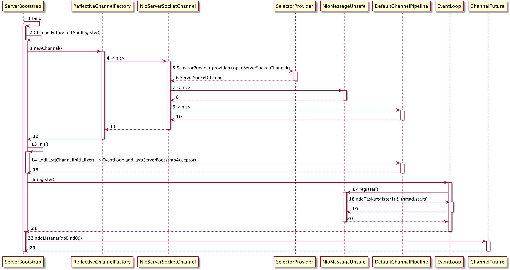

### 2.EventLoop线程执行的Task拆解

- task-1:将Channel注册到Selecter上，PS:仅仅是注册(interestOps=0),不监听任何IO操作;同时增加task-2、task-3
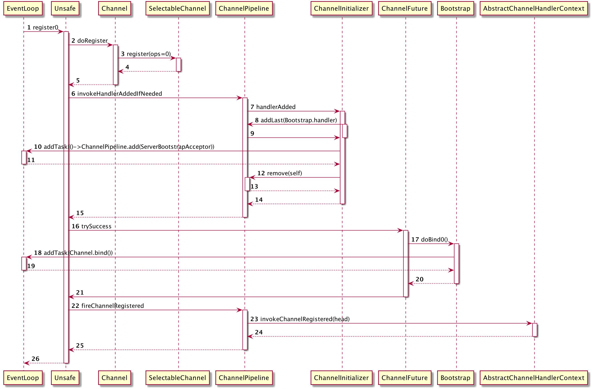

- task-2:把Server核心逻辑ServerBootstrapAcceptor加到Pipeline中
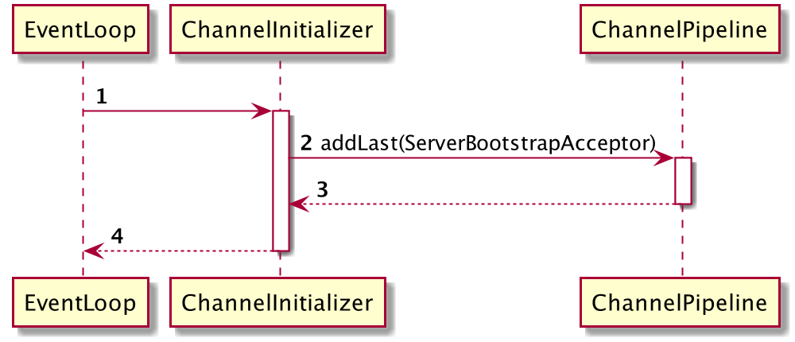

- task-3:执行绑定端口操作，同时增添加task-4
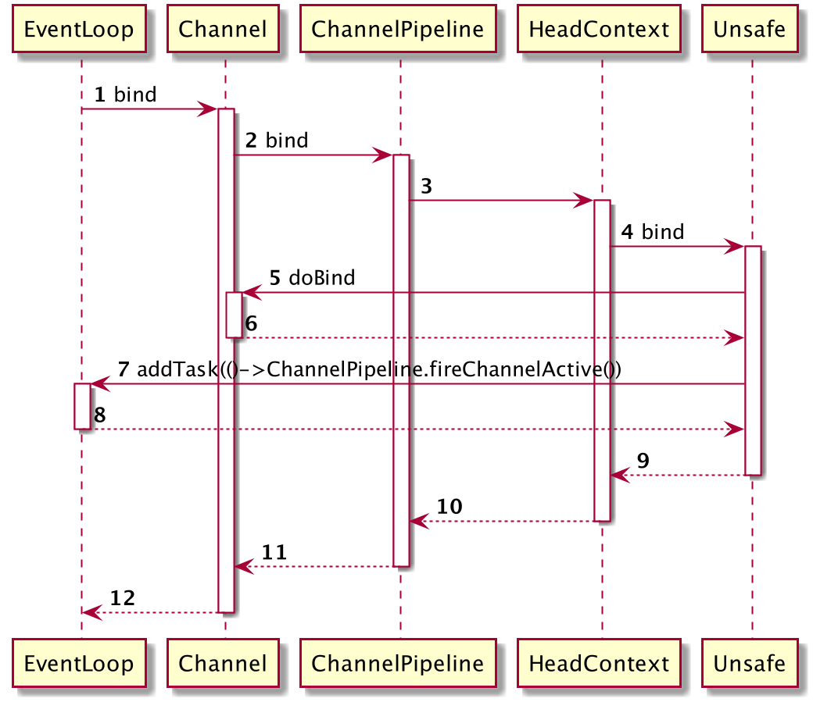

- task-4:监听ACCEPT事件，设置interestOps=16
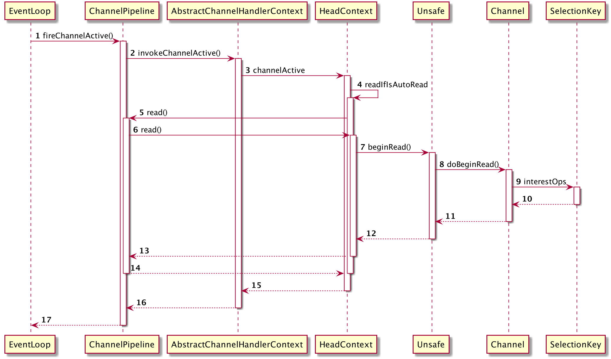

## 四.完整的connect & read
略:与bind的流程相似。 

## 五.完整的write流程

### 1.初始化
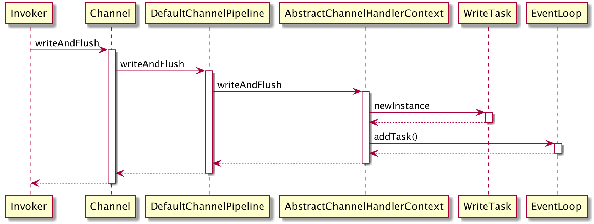

### 2.EventLoop线程执行的Task
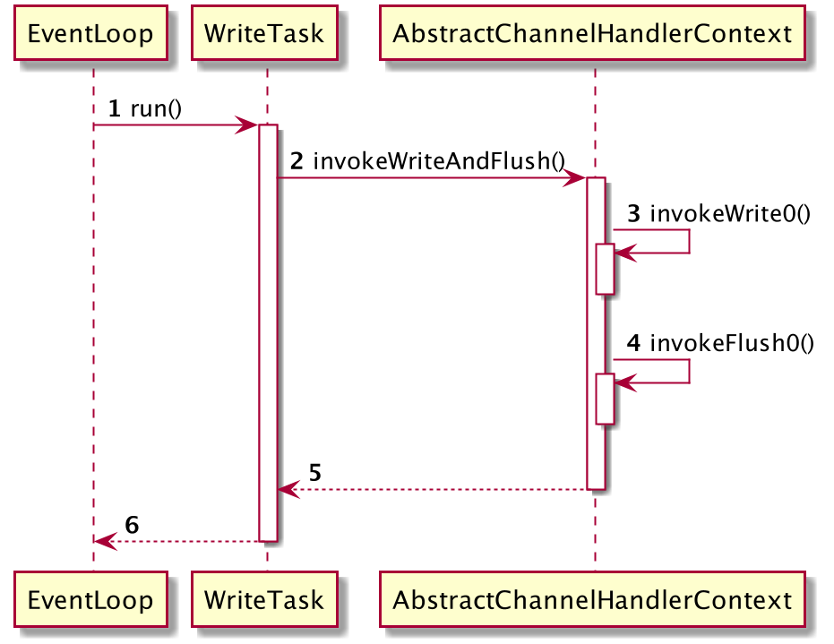
