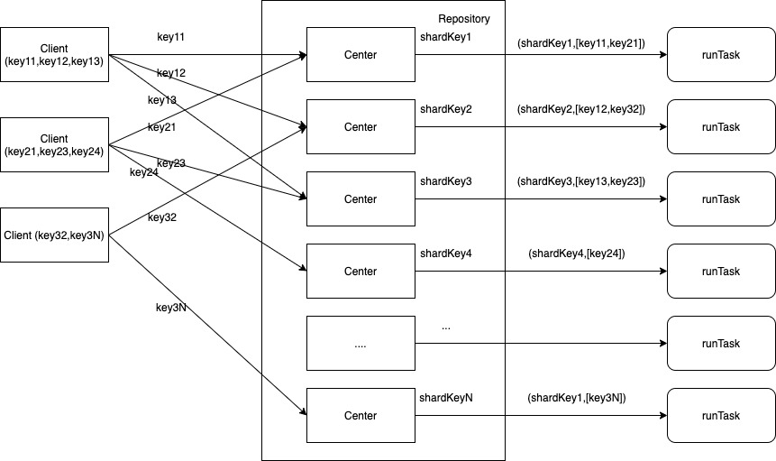

# 分表查询的优化
```
海量数据MySQL存储往往使用分库分表的方案，而分库分表后，数据查询效率可能出现退化，举个栗子：每批次10个分库键(比如说视频ID)查询数据，不分表时只需要查询一次就可以了；分100张表时需要查询10次才行。本文总结了几种方案，并在特定场景下压测了相应方案的效率。
```

## 一.方案对比
### &emsp;0.压测说明
```
数据配置:5.7.26-29-log
5个库，分100张表，每个库20张表，每次查询随机(ThreadLocalRandom)取10条数据。
```

### &emsp;1.方案一:顺序查询
##### &emsp;&emsp;1) code
```
ids.stream().collect(Collectors.groupingBy(this::shard, Collectors.toSet()))
        .forEach((sKey, keys) -> run(sKey, keys));
```
##### &emsp;&emsp;2) 压测结果
线程数 | 吞吐量(ops/ms) | 平均耗时(ms/ops)
---|--- |---
10 | 1.872 | 5.169
100 | 5.551 | 17.948
200 | 5.478 | 37.181

### &emsp;2.方案二:线程池(固定coreSize=100+无限queue)
##### &emsp;&emsp;1) code
```
ids.stream().collect(Collectors.groupingBy(this::shard, Collectors.toSet()))
        .map((sKey, keys) -> executor.submit(()->run(sKey, keys)))
        .collect(Collectors.toList())
        .stream()
        .map(f -> f.get());    
```
##### &emsp;&emsp;2) 压测结果
线程数 | 吞吐量(ops/ms) | 平均耗时(ms/ops)
---|---|---
10 | 1.872 | 5.169
100 | 5.329 | 18.832
200 | 5.350 | 37.661
##### &emsp;&emsp;3) 分析
并没有减少查询往返数量，此外使用线程池会占用业务本身的线程。

### &emsp;3.方案三:并发聚合查询
##### &emsp;&emsp;1) 聚合原理

##### &emsp;&emsp;2) 压测结果
线程数 | 吞吐量(ops/ms) | 平均耗时(ms/ops)
---|---|---
10 | 2.415 | 4.182
100 | 9.065 | 11.112
200 | 9.394 | 21.239
##### &emsp;&emsp;3) 分析
从压测结果看，在并发10、100、200下，数据查询的吞吐量、平均耗时有明显效果。此外该方案在并发小时退化成了方案一(这个不是主要问题)。
### &emsp;4.方案四:并发聚合查询+线程池(固定coreSize=100+无限queue)
##### &emsp;&emsp;1) 压测结果
线程数 | 吞吐量(ops/ms) | 平均耗时(ms/ops)
---|---|---
10 | 4.031 | 2.474
100 | 7.826 | 12.673  
200 | 9.509 | 20.804
##### &emsp;&emsp;2) 分析
从压测结果看，使用线程池并没有比方案三表现更好多少。
### &emsp;5.方案五:并发聚合查询+线程池(固定coreSize=10+queueSize=100+CallerRunsPolicy)
##### &emsp;&emsp;1) 压测结果
线程数 | 吞吐量(ops/ms) | 平均耗时(ms/ops)
---|---|---
10 | 3.903 | 2.445
100 | 8.295 | 12.220
200 | 9.609 | 20.877
##### &emsp;&emsp;2) 分析
该方案主要是为了考虑并发小时的一个折中,并发小时可以通过并发查询提高效率。
### &emsp;6.方案六:并发聚合查询 + rpc-hash
##### &emsp;说明
方案一~方案五都是在单个实例内的聚合，而通过rpc-hash的方式可以把多个实例中相同分区的数据hash到一个实例中，然后再用聚合组件把实例内的数据聚合查询。但是这种方案耦合了rpc的hash策略和聚合组件的分区策略。

## 二.聚合组件代码
### &emsp;0.demo
```
    BiFunction<Integer, Set<Long>, Map<Long, Data>> task = (sKey, keys) -> {
        Map<Long, Data> data = Maps.newHashMap();

        return data;
    };
    ShareRepository<Long, Integer, Data> repo = ShareRepository.repo(task, key -> (int) (key % 100));
    ShareClient<Long, Integer, Data> client = repo.client(keys1);
    client.add(keys2);
    client.add(keys3);
    Map<Long, Data> data = client.get();
```
### &emsp;1.[ShareRepository片段](https://github.com/Kuojian21/kj-repo/blob/master/kj-repo-infra/src/main/java/com/kj/repo/infra/share/ShareRepository.java)
```
    public static <K, S, V> ShareRepository<K, S, V> repo(BiFunction<S, Set<K>, Map<K, V>> task, Function<K, S> shard,
            Supplier<Executor> executor, int loadBatchSize, double loadBatchFactor, long clientSleepMills,
            Lock loadLock) {
        return new ShareRepository<>(task, shard, executor, loadBatchSize, loadBatchFactor, clientSleepMills, loadLock);
    }

    public ShareClient<K, S, V> client(Collection<K> keys) {
        return new ShareClient<>(keys, key -> repo.computeIfAbsent(shard.apply(key),
                sKey -> new ShareCenter<>(sKey, task, loadBatchSize, loadBatchThreshold, loadLock)), this.executor,
                clientSleepNano);
    }

```

### &emsp;2.[ShareCenter片段](https://github.com/Kuojian21/kj-repo/blob/master/kj-repo-infra/src/main/java/com/kj/repo/infra/share/ShareCenter.java)
```
    public ShareClientRequest<K, S, V> add(Set<K> keys, WeakReference<ShareClient<K, S, V>> reference) {
        ShareClientRequest<K, S, V> request = new ShareClientRequest<>(reference);
        iRequests.put(request, keys);
        return request;
    }

    public void run(List<ShareClientRequest<K, S, V>> requests) {
        Map<ShareClientRequest<K, S, V>, Set<K>> cRequestMap =
                this.loadLock == null ? requests(requests) : this.runInLock(this.loadLock, () -> requests(requests));
        try {
            if (MapUtils.isEmpty(cRequestMap)) {
                return;
            }
            Map<K, Set<ShareClient<K, S, V>>> clientMap =
                    cRequestMap.entrySet().stream().map(e -> Pair.of(e.getKey().getClient(), e.getValue()))
                            .filter(pair -> pair.getKey() != null && pair.getValue() != null)
                            .flatMap(pair -> pair.getValue().stream().map(key -> Pair.of(key, pair.getKey())))
                            .collect(Collectors.groupingBy(Pair::getKey)).entrySet().stream()
                            .collect(Collectors.toMap(Map.Entry::getKey,
                                    e -> e.getValue().stream().map(Pair::getValue).collect(Collectors.toSet())));
            Map<K, V> datas = task.apply(this.sKey, clientMap.keySet());
            datas.forEach((k, v) -> clientMap.remove(k).forEach(client -> client.getData().get(k).complete(v)));
            clientMap.forEach((k, v) -> v.forEach(client -> client.getData().get(k).complete(null)));
        } catch (Exception e) {
            e.printStackTrace();
        }
    }
```
### &emsp;3.[ShareClient片段](https://github.com/Kuojian21/kj-repo/blob/master/kj-repo-infra/src/main/java/com/kj/repo/infra/share/ShareClient.java)
```
    public void add(Collection<K> keys) {
        if (this.get) {
            this.time = System.nanoTime();
            this.get = false;
        }
        keys.forEach(key -> data.putIfAbsent(key, new CompletableFuture<>()));
        keys.stream().collect(Collectors.groupingBy(this.shard, Collectors.toSet()))
                .forEach((center, vKeys) -> this.requests.computeIfAbsent(center, t -> Lists.newArrayList())
                        .add(center.add(vKeys, this.reference)));
    }

    public Map<K, V> get() {
        this.get = true;
        long internal = System.nanoTime() - time;
        if (internal < sleepNano) {
            Uninterruptibles.sleepUninterruptibly(sleepNano - internal, TimeUnit.NANOSECONDS);
        }
        List<ShareCenter<K, S, V>> centers =
                new ArrayList<>(
                        this.data.entrySet().stream().filter(entry -> !entry.getValue().isDone()).map(Entry::getKey)
                                .collect(Collectors.groupingBy(shard, Collectors.toSet())).keySet());
        if (CollectionUtils.isNotEmpty(centers)) {
            for (int i = 1, len = centers.size(); i < len; i++) {
                ShareCenter<K, S, V> center = centers.get(i);
                executor.get().execute(() -> center.run(this.requests.get(center)));
            }
            ShareCenter<K, S, V> center = centers.get(0);
            center.run(this.requests.get(center));
        }
        return this.data.entrySet().stream()
                .map(entry -> Pair.of(entry.getKey(), getUnchecked(entry.getValue())))
                .filter(entry -> entry.getValue() != null).collect(Collectors.toMap(Pair::getKey, Pair::getValue));
    }
```

## 三.压测出来的问题总结
1. 100并发每批次为10时:方案三的平均聚合度是3,数据库查询平均耗时是600~800微秒/条，而每次查询1条数据时(方案一、方案二)，平局耗时是1700~1900微秒/条，从结果看聚合组件的时间消耗是微秒级别的。

2. 数据库每次查询多少条数据效率是最高的，要综合数据库、网络及每条数据的大小来决定,比如说：查询中包含text字段，我测试结果是，每次1条与每次3条平均耗时相差很小。总之，不能武断的认为每次查询越多越好，还是要看测试效果。

3. jdbc的fetch-size参数:to specify the number of rows to be fetched from the database when additional rows are needed.(据说这个值一般是10)。

4. 压测不调用client.get()是否会内存泄漏的问题时，发现了java.lang.ref.Finalizer任务，这个任务负责调用对象的finalize(),当finalize()跟不上对象产生速度时会产生大量的java.lang.ref.Finalizer对象，内存回收数次后出现【GC overhead limit exceeded】问题。
